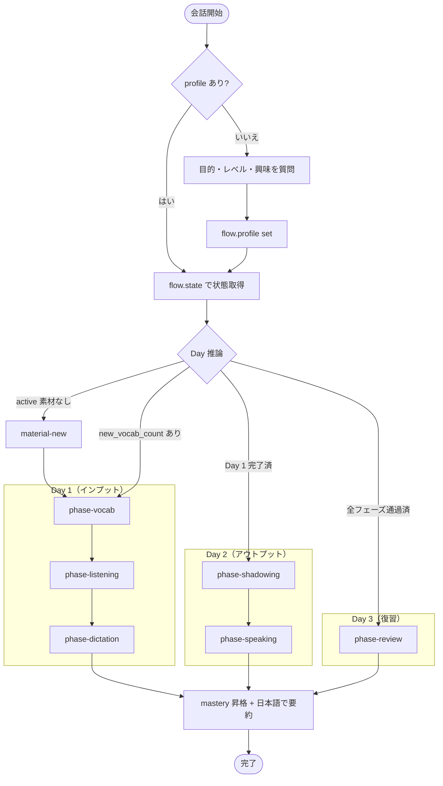

# english-tutor

第二言語習得（SLA）研究の知見に基づいた英語学習システム。Kiro CLI 上で動作するエージェントが、毎日のメニュー（語彙インプット → 多聴 → 精聴 → シャドーイング → スピーキング → 復習）を SQLite の状態から動的に決め、ユーザーと一問一答で進めます。学習履歴は Streamlit ダッシュボードで可視化できます。

## 設計の理論的背景

- **インプット仮説**（Krashen）：理解可能なインプット（i+1）の量
- **アウトプット仮説**（Swain）：「言えなかった」気づきが習得を進める
- **インタラクション仮説**（Long）：意味交渉を伴う対話
- **間隔反復**：忘れかけたタイミングでの復習
- **深い処理**（Craik & Lockhart）：同じ素材を多角的に処理

詳細は [`spec/PLAN.md`](spec/PLAN.md) を参照。

## 技術スタック

| レイヤー | 技術 |
|---|---|
| エージェント基盤 | Kiro CLI |
| AI | Claude API（教材・問題生成、採点） |
| 音声出力 | macOS `say` コマンド（自前キャッシュ） |
| 音声入力 | Kiro 標準の音声入力 |
| データベース | SQLite |
| ダッシュボード | Streamlit |
| 言語 | Python 3.11+ |

## セットアップ

```bash
git clone <this repo>
cd english-tutor
pip install -e .          # streamlit / pandas / altair / pyyaml
python -m english_tutor.db.connection   # data/learning.db を作成（idempotent）
```

`pip install` の代わりに `study` スクリプトが `PYTHONPATH=src` を export するので、開発中はインストール不要でも動きます。

## 起動

```bash
./study
```

`study` は次を自動でやります：

1. `data/learning.db` の初期化（無ければ）
2. Streamlit ダッシュボードをバックグラウンド起動（http://localhost:8501）
3. Kiro エージェント `english-tutor` を起動

エージェントが立ち上がるとそのまま学習が開始されます。明示的なコマンドは不要です。初回はプロファイル（目的・レベル・興味分野）を聞かれます。

ダッシュボードのみ起動したい場合：

```bash
PYTHONPATH=src streamlit run dashboard/app.py
```

## 全体フロー



`cycles` テーブルは持たず、エージェントが `vocabulary_items` の習熟度・出現履歴と `sessions` 履歴から、その日に進めるべきフェーズを動的に判断します。

## ディレクトリ構成

```
english-tutor/
├── pyproject.toml
├── study                              # 起動シェルスクリプト
│
├── .kiro/
│   ├── agents/
│   │   ├── english-tutor.json         # Kiro エージェント定義
│   │   └── english-tutor.md           # フローコントローラ指示（Mermaid 図含む）
│   └── skills/
│       ├── material-new/SKILL.md      # 新素材生成（未解決ミスを織り込む）
│       ├── phase-vocab/SKILL.md       # 語彙・文法・表現インプット
│       ├── phase-listening/SKILL.md   # 多聴
│       ├── phase-dictation/SKILL.md   # 精聴・ディクテーション
│       ├── phase-shadowing/SKILL.md   # シャドーイング
│       ├── phase-speaking/SKILL.md    # スピーキング・リテンション
│       └── phase-review/SKILL.md      # Day 3 復習
│
├── src/english_tutor/
│   ├── db/
│   │   ├── schema.sql                 # 5テーブルのスキーマ
│   │   └── connection.py              # 接続 + init
│   ├── flow/                          # JSON 入出力の薄い CLI
│   │   ├── profile.py                 #   user_profile の読み書き
│   │   ├── material.py                #   素材 + vocabulary_items を一括 INSERT
│   │   ├── state.py                   #   学習状態のスナップショット
│   │   ├── due.py                     #   出題候補スコアリング
│   │   ├── mistakes.py                #   未解決ミスの抽出
│   │   ├── session.py                 #   session 行 open/close
│   │   ├── record.py                  #   questions に Q&A 記録 + 統計更新
│   │   └── mastery.py                 #   mastery_level の昇格
│   └── audio/tts.py                   # macOS say ラッパー（キャッシュ付き）
│
├── dashboard/
│   ├── app.py                         # st.navigation エントリ
│   ├── db.py                          # 読み取りクエリ
│   └── views/
│       ├── home.py                    # 累積統計・習熟度分布・直近活動
│       └── material_detail.py         # 素材ごとの vocab・session・Q&A
│
├── data/                              # gitignore（.gitkeep のみ追跡）
│   ├── learning.db                    # SQLite 本体
│   └── audio/                         # say で生成した音声キャッシュ
│
└── spec/PLAN.md                       # 詳細設計
```

## データモデル

5 テーブルでフラットに保持。固定的な「Day 1-3 サイクル」テーブルは持たず、`vocabulary_items` の出題統計から動的にスコアリング。

| テーブル | 役割 |
|---|---|
| `user_profile` | 学習者設定（singleton 1 行：goal / level / interests） |
| `materials` | 教材本体（script + 学習統計 + mastery_level） |
| `vocabulary_items` | 学習対象（vocab / grammar / expression）＋出題統計。**スコアリングの主体** |
| `sessions` | 学習活動の記録（material × phase × 時刻） |
| `questions` | Q&A 記録（出題内容・解答・正誤）。再利用しない履歴ログ |

### スコアリング（PLAN §6）

```
interval_days = 2 ** mastery_level             # 0:1d, 1:2d, 2:4d, 3:8d
days_elapsed  = now - last_appeared_at
due_score     = days_elapsed - interval_days   # >0 で出題対象、大きいほど優先
```

新規 vocabulary_item（`last_appeared_at IS NULL`）は最大優先。

## ヘルパーコマンド

エージェントは Bash 経由でこれらを呼び出します。手動でデバッグする場合は `PYTHONPATH=src` を付けてください。

| コマンド | 用途 |
|---|---|
| `python -m english_tutor.db.connection` | DB 初期化 |
| `python -m english_tutor.flow.profile {get,set}` | プロファイル読み書き |
| `python -m english_tutor.flow.state` | 学習状態スナップショット |
| `python -m english_tutor.flow.material` | 素材＋vocabulary_items 一括 INSERT（stdin JSON） |
| `python -m english_tutor.flow.due --type vocab --limit N` | 出題候補（due_score 順） |
| `python -m english_tutor.flow.mistakes --limit N` | 未解決ミス |
| `python -m english_tutor.flow.session {open,close}` | セッション開閉 |
| `python -m english_tutor.flow.record` | Q&A を記録（stdin JSON） |
| `python -m english_tutor.flow.mastery {vocab,material} --id ID --level L` | 習熟度を昇格 |
| `python -m english_tutor.audio.tts "..."` | macOS say で読み上げ（キャッシュ） |

## 開発メモ

- `data/` 配下は `.gitignore`。学習履歴と音声キャッシュは手元固有
- スキーマ変更時は `data/learning.db` を削除して再生成（`python -m english_tutor.db.connection`）
- ダッシュボードは `@st.cache_data(ttl=10)` で 10 秒キャッシュしているので、エージェント側の更新が反映されないときはリロードを少し待つ

詳細な設計判断（`vocabulary_items` ベースのスコアリング、間違えた表現の導出クエリ、リテンションテストの形など）は [`spec/PLAN.md §6`](spec/PLAN.md) にまとまっています。
